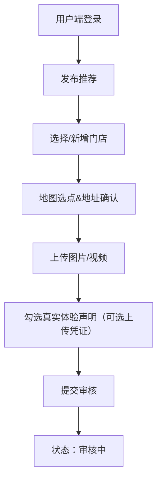
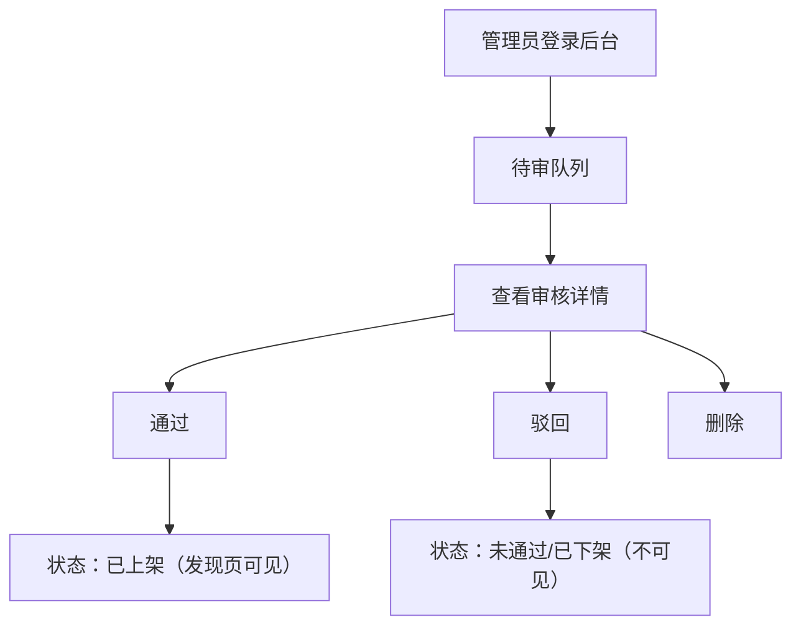

## 1. 产品概述
“食探地图”是一款用户上传真实到店体验的美食推荐平台，包含用户端与后台管理端，用于发布、审核与上架门店推荐内容。
- 解决“去哪家店不踩雷”的信息不对称问题，用真实到店体验与审核机制提升内容可信度
- 以低成本（优先免费第三方服务）快速上线，支持图片/视频与门店地理位置

## 2. 核心功能

### 2.1 用户角色
| 角色 | 注册方式 | 核心权限 |
|------|----------|----------|
| 普通用户 | 手机号注册登录（优先短信验证码；可降级为手机号+密码以实现真正0短信成本） | 浏览内容、发布推荐、上传图/视频、提交门店位置、管理自己的发布 |
| 审核管理员 | 后台账号 | 审核内容、上下架、删除、处理举报 |
| 超级管理员 | 后台账号 | 管理员管理、全站配置、黑名单/风控策略 |

### 2.2 功能模块（页面级）
1. **用户端：发现页**：推荐流、筛选、附近/城市切换、搜索
2. **用户端：发布推荐页**：选择/新增门店、选点定位、上传图/视频、填写体验内容、提交声明
3. **用户端：门店详情/推荐详情页**：内容展示、地图定位、用户信息、时间、（可选）举报入口
4. **用户端：我的**：登录/注册、我的发布（草稿/审核中/已上架/已下架）、编辑/删除、隐私与声明
5. **后台端：审核工作台**：待审列表、详情审核、通过/驳回、上下架、删除、用户与内容检索

### 2.3 页面细化
| 页面名称 | 模块名称 | 功能说明 |
|---------|----------|----------|
| 发现页 | 推荐流 | 按最新/热度排序，支持分页/无限滚动 |
| 发现页 | 筛选与搜索 | 城市/距离/标签/人均（可选），关键字搜索门店与内容 |
| 发布推荐页 | 门店选择 | 搜索门店（基于OpenStreetMap地理反查/地址搜索）或手动新增门店信息 |
| 发布推荐页 | 位置选点 | 地图拖拽选点+自动读取经纬度；允许手动微调地址 |
| 发布推荐页 | 媒体上传 | 上传多张图片与1个视频（或多媒体混合），支持进度与失败重试 |
| 发布推荐页 | 真实体验声明 | 勾选“本人真实到店消费体验”；可选上传消费凭证（不公开，仅审核可见） |
| 详情页 | 内容展示 | 门店信息、地图定位、图/视频、正文、发布时间、作者信息 |
| 我的 | 内容管理 | 查看状态、撤回（审核中可撤回）、编辑、删除 |
| 后台审核 | 队列 | 按时间/风险等级排序，支持批量通过/驳回（可选） |
| 后台审核 | 审核详情 | 查看门店位置、媒体、正文、（可选）凭证；通过/驳回原因模板 |
| 后台内容管理 | 上下架/删除 | 通过上架；驳回/下架不展示；删除为不可恢复（需二次确认） |

## 3. 核心流程

### 3.1 用户发布流程
1) 手机号注册/登录
2) 进入发布页 → 搜索/新增门店 → 地图选点
3) 填写推荐内容 → 上传图片/视频 → 勾选真实体验声明 → 提交
4) 内容进入“审核中”，用户可在“我的发布”查看状态

### 3.2 后台审核与上架流程
1) 管理员登录后台
2) 打开待审队列 → 查看详情（媒体、正文、门店位置、可选凭证）
3) 通过：内容上架并进入发现页/详情页可见
4) 驳回：内容下架并记录原因；用户端展示“未通过”与原因（可选）
5) 删除：内容与媒体标记删除（可配置是否物理删除媒体）

## 4. 用户界面设计

### 4.1 设计风格
- 方向：城市生活方式/探店地图风格，偏“编辑部推荐”质感
- 主色：米白/暖灰（背景）+ 深墨黑（文字）+ 辣椒红/柑橘橙（强调）
- 字体：标题用高对比衬线（增强“推荐手册”质感），正文用易读无衬线
- 布局：卡片+地图融合；列表信息密度适中；发布页强调步骤清晰
- 动效：卡片入场轻微上浮与淡入；上传进度与成功提示要明确

### 4.2 页面设计概览
| 页面名称 | 模块名称 | UI要点 |
|---------|----------|--------|
| 发现页 | 顶部城市/搜索 | 顶部固定栏，支持输入提示与历史记录 |
| 发现页 | 推荐卡片 | 大图优先、门店名与区域、1-2行亮点文案、距离（可选） |
| 发布推荐页 | 步骤条 | 1 选门店 → 2 选位置 → 3 写内容 → 4 上传媒体 → 5 提交 |
| 详情页 | 地图信息块 | 小地图+地址+一键复制；强调“真实到店体验”标识 |
| 后台 | 审核列表 | 清晰状态标签、风险提示、快捷操作（通过/驳回） |

### 4.3 响应式
- 桌面优先：后台管理端桌面体验优先
- 移动适配：用户端重点适配移动端，支持触控、拍照/录像上传与定位授权提示
