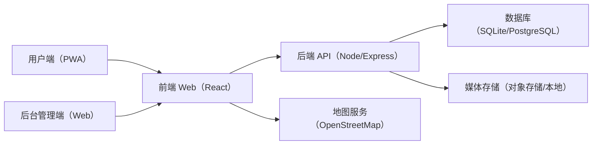
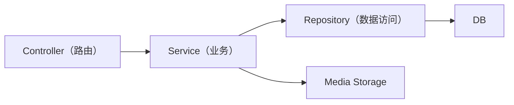
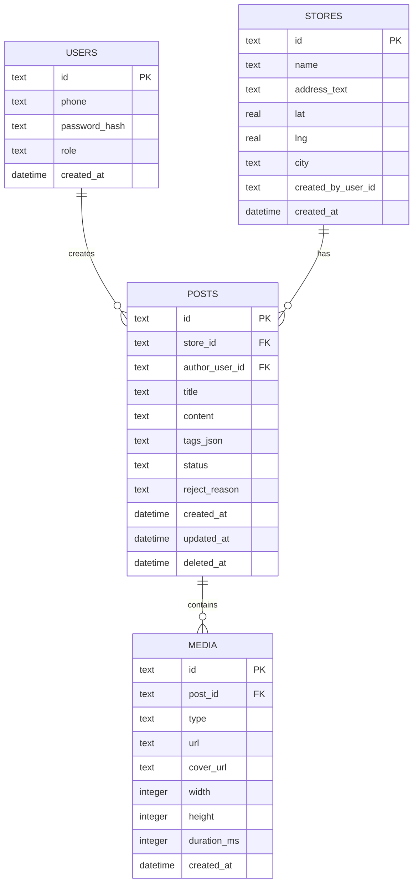

## 1. 架构设计



说明：
- 为实现“第三方免费/低成本”优先：可先用“单体后端 + SQLite + 本地媒体（开发/演示）”快速跑通；上线阶段再切换到免费额度的托管数据库与对象存储
- 短信验证码无法保证真正0成本：可在技术上预留“短信服务适配层”，MVP 默认降级为“手机号+密码”或“验证码仅用于演示环境”

## 2. 技术选型说明
- 前端：React@18 + TypeScript + Vite
- UI：tailwindcss@3
- 路由：react-router-dom
- 表单：react-hook-form（如仓库未引入则改用原生表单+自研校验）
- 地图：leaflet + OpenStreetMap tiles（如仓库未引入则在实现阶段再确认）
- 后端：Node.js + Express@4（REST API）
- 数据库：开发/自托管 SQLite；上线建议 PostgreSQL（可用免费额度托管）
- 媒体存储：开发环境本地文件；上线建议对象存储（免费额度/低成本）
- 鉴权：JWT（用户端）+ 管理员会话（后台）

## 3. 路由定义
| 路由 | 用途 |
|------|------|
| / | 用户端发现页 |
| /login | 用户端登录/注册 |
| /post/new | 发布推荐 |
| /post/:id | 推荐详情 |
| /store/:id | 门店详情 |
| /me | 我的（发布管理） |
| /admin | 后台登录 |
| /admin/review | 审核队列 |
| /admin/review/:id | 审核详情 |
| /admin/content | 内容管理 |
| /admin/users | 用户管理（可选） |

## 4. API 定义（后端存在时）

### 4.1 类型定义（TypeScript）
```ts
export type ReviewStatus = "pending" | "approved" | "rejected" | "off_shelf" | "deleted";

export type Store = {
  id: string;
  name: string;
  addressText: string;
  lat: number;
  lng: number;
  city?: string | null;
  createdAt: string;
  createdByUserId: string;
};

export type Post = {
  id: string;
  storeId: string;
  authorUserId: string;
  title: string;
  content: string;
  tags: string[];
  status: ReviewStatus;
  rejectReason?: string | null;
  createdAt: string;
  updatedAt: string;
};

export type Media = {
  id: string;
  postId: string;
  type: "image" | "video";
  url: string;
  coverUrl?: string | null;
  width?: number | null;
  height?: number | null;
  durationMs?: number | null;
  createdAt: string;
};
```

### 4.2 认证
- POST /api/auth/register：手机号注册（MVP：手机号+密码；短信版需要外部短信通道）
- POST /api/auth/login：登录换取 access token
- POST /api/auth/logout：注销

### 4.3 用户端内容
- GET /api/posts：已上架内容列表（支持 city、nearby、keyword、tag、page）
- GET /api/posts/:id：内容详情（仅 approved 可见；作者可见自己的非删除内容）
- POST /api/posts：创建内容（status=pending）
- PUT /api/posts/:id：作者编辑（仅 pending/rejected 可编辑；可配置）
- DELETE /api/posts/:id：作者删除（软删除）

### 4.4 门店
- POST /api/stores：新增门店（含经纬度与地址文本）
- GET /api/stores/search：按关键字/经纬度搜索（结合 OSM 反查/地址搜索）
- GET /api/stores/:id：门店详情与相关内容

### 4.5 媒体上传
- POST /api/uploads/presign：获取上传凭证（对象存储直传时）
- POST /api/media：记录媒体元数据并关联 post

### 4.6 后台审核
- GET /api/admin/reviews：待审列表（pending）
- GET /api/admin/reviews/:id：审核详情
- POST /api/admin/reviews/:id/approve：通过上架（approved）
- POST /api/admin/reviews/:id/reject：驳回（rejected + reason）
- POST /api/admin/reviews/:id/off-shelf：下架（off_shelf）
- DELETE /api/admin/posts/:id：删除（deleted）

## 5. 服务端架构图


## 6. 数据模型

### 6.1 ER 图


### 6.2 DDL（以SQLite为例）
```sql
CREATE TABLE users (
  id TEXT PRIMARY KEY,
  phone TEXT NOT NULL UNIQUE,
  password_hash TEXT,
  role TEXT NOT NULL DEFAULT 'user',
  created_at TEXT NOT NULL
);

CREATE TABLE stores (
  id TEXT PRIMARY KEY,
  name TEXT NOT NULL,
  address_text TEXT NOT NULL,
  lat REAL NOT NULL,
  lng REAL NOT NULL,
  city TEXT,
  created_by_user_id TEXT NOT NULL,
  created_at TEXT NOT NULL,
  FOREIGN KEY(created_by_user_id) REFERENCES users(id)
);

CREATE TABLE posts (
  id TEXT PRIMARY KEY,
  store_id TEXT NOT NULL,
  author_user_id TEXT NOT NULL,
  title TEXT NOT NULL,
  content TEXT NOT NULL,
  tags_json TEXT NOT NULL DEFAULT '[]',
  status TEXT NOT NULL DEFAULT 'pending',
  reject_reason TEXT,
  created_at TEXT NOT NULL,
  updated_at TEXT NOT NULL,
  deleted_at TEXT,
  FOREIGN KEY(store_id) REFERENCES stores(id),
  FOREIGN KEY(author_user_id) REFERENCES users(id)
);

CREATE INDEX idx_posts_status ON posts(status);
CREATE INDEX idx_posts_store ON posts(store_id);
CREATE INDEX idx_posts_author ON posts(author_user_id);

CREATE TABLE media (
  id TEXT PRIMARY KEY,
  post_id TEXT NOT NULL,
  type TEXT NOT NULL,
  url TEXT NOT NULL,
  cover_url TEXT,
  width INTEGER,
  height INTEGER,
  duration_ms INTEGER,
  created_at TEXT NOT NULL,
  FOREIGN KEY(post_id) REFERENCES posts(id)
);

CREATE INDEX idx_media_post ON media(post_id);
```
